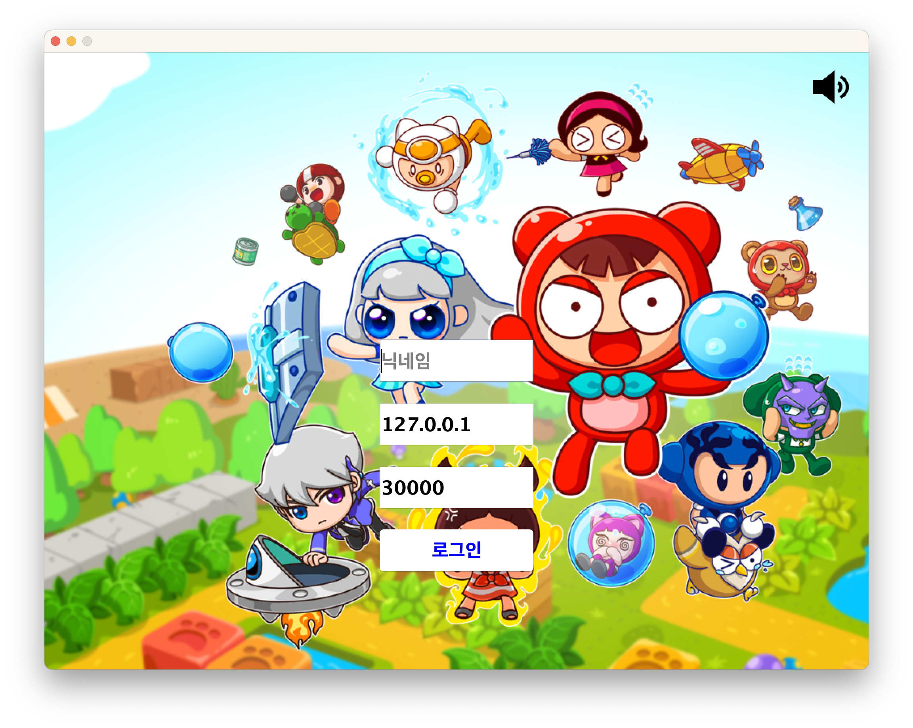
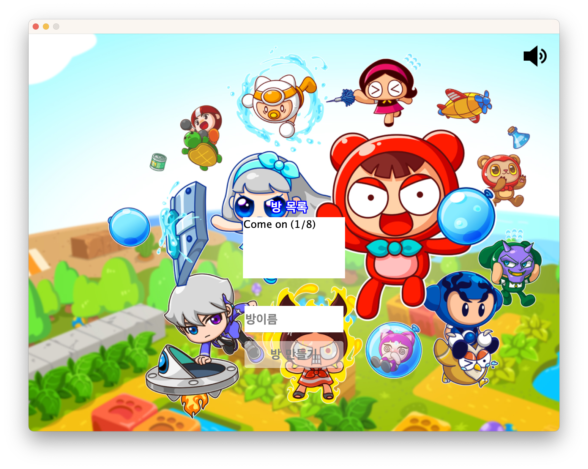
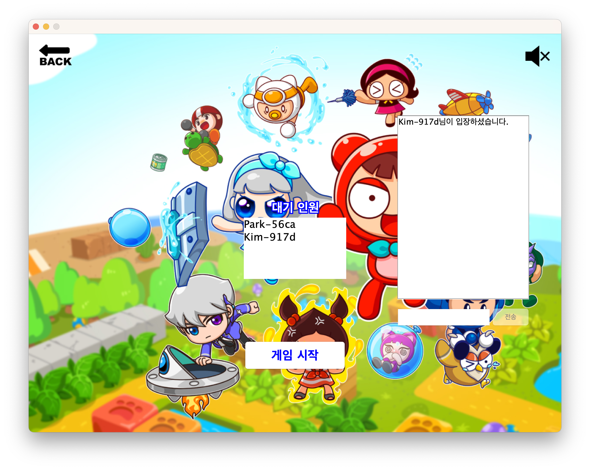
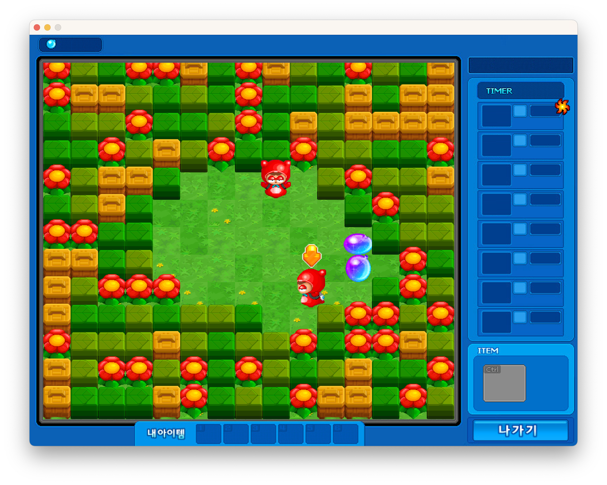
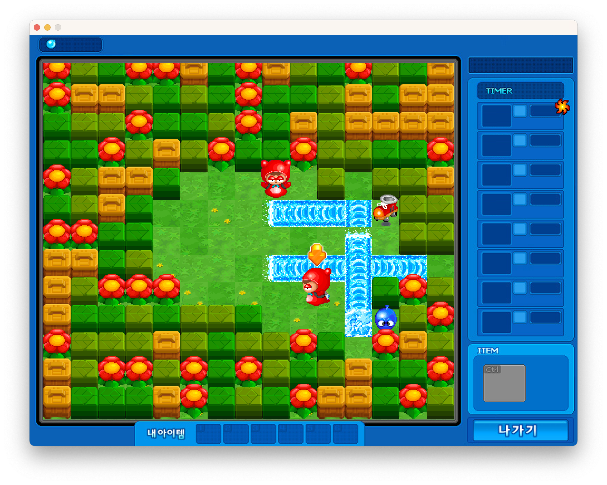
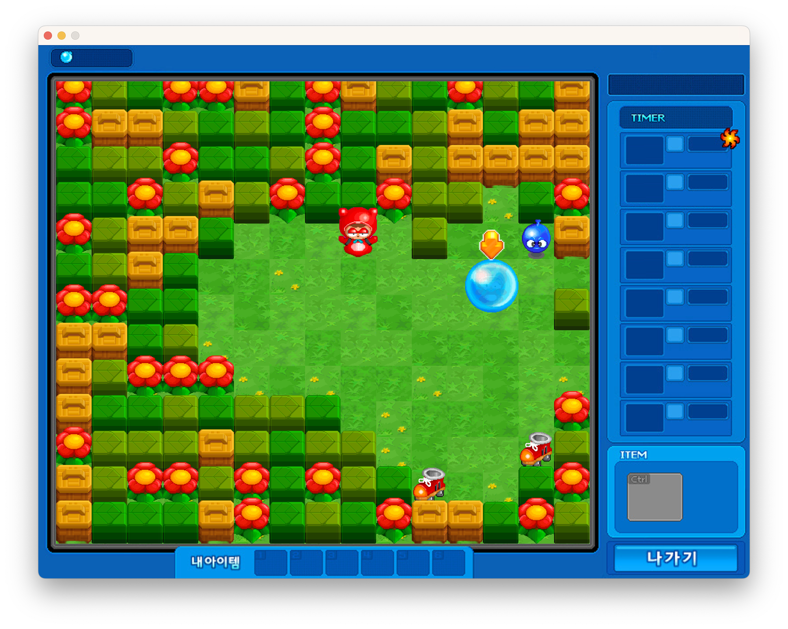
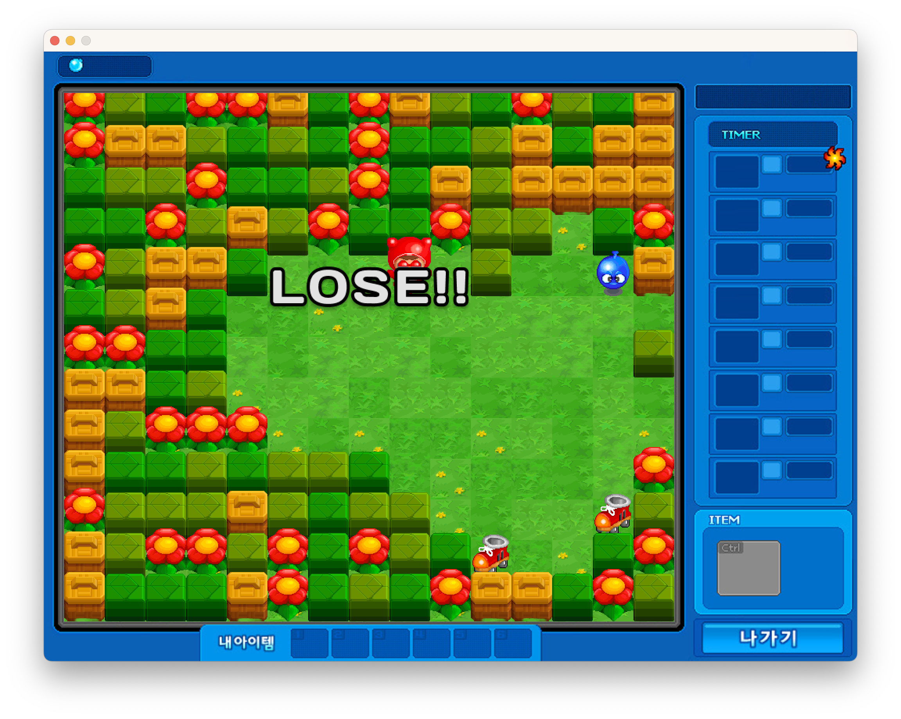

# CrazyArcade

한성대학교 3학년 2학기 네트워크프로그래밍 과목 텀프로젝트입니다.
자바 Swing과 소켓을 이용하여 개발한 크레이지 아케이드입니다.
 
# Getting Started

1. `ServerMain` 실행
2. `ClientMain` 여러번 실행
3. 각 클라이언트 로그인
    - 로컬 테스트의 경우 IP와 PORT 번호 수정 안해도 됨
4. 게임방 생성
5. 다른 인원이 게임방 접속
6. 게임 시작
7. 게임 플레이

# Architecture

- client
- domain
- server

# Features

- 게임방
  - 게임방마다 최대 8인 게임 플레이
  - 채팅 기능
- 물풍선
  - 플레이어마다 최대 설치 갯수 존재
  - 폭발시 물줄기에 닿는 주변 물풍선이 함께 폭발되는 연쇄 폭발 기능
  - 물줄기에 플레이어가 맞는 경우 플레이어가 물풍선에 갇힘
- 아이템
  - 물풍선: 최대 물풍선 갯수 늘려줌
  - 롤러: 움직임 속도 빨라짐
  - 울트라: 물줄기 길이 최대치까지 늘려줌
  - 물약: 물줄기 길이 하나 늘려줌
- 기타
  - 블럭 모서리에서 특정 방향으로 움직이는 경우 오차허용하여 움직이는 기능 있음
  - 파도타기 가능(한 쪽 발만 물줄기에 닿는 경우 물줄기에 갇히지 않음)

# Screenshots

